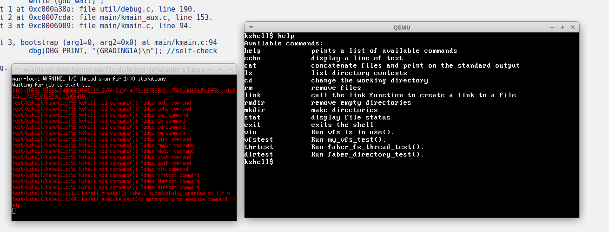
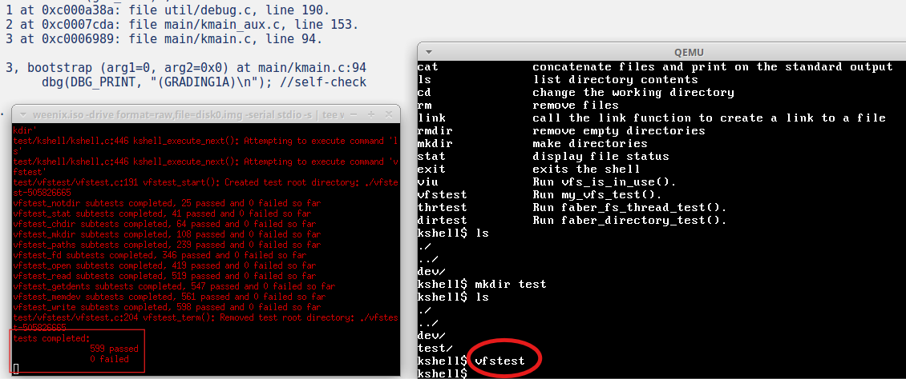
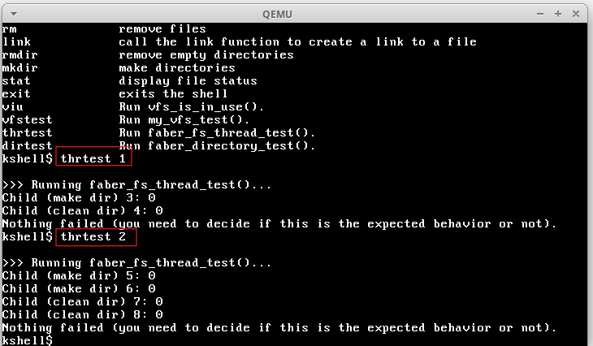
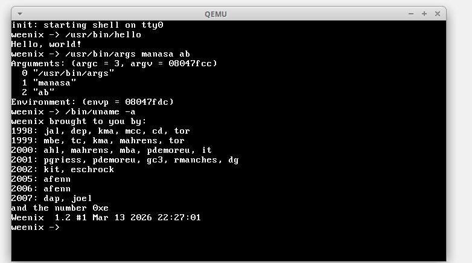
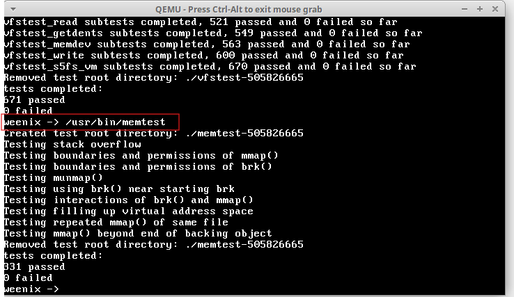
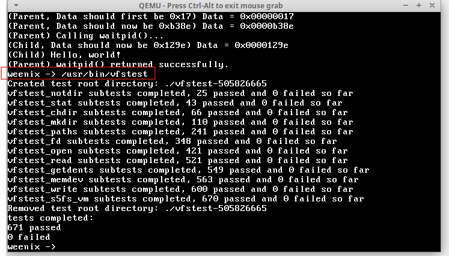
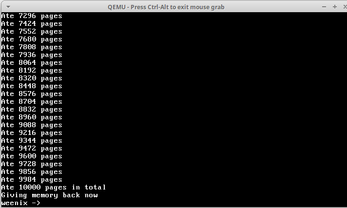
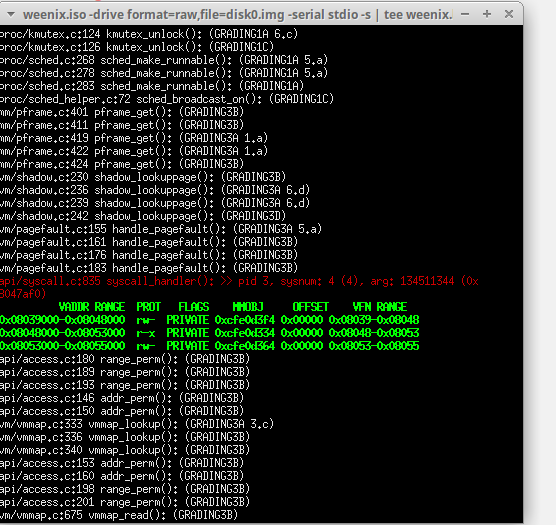

# weenix-kernel

Developed core components of the Weenix educational OS kernel as part of the CSCI-402 Operating Systems course at the University of Southern California (USC); the source code cannot be publicly shared due to course academic policies.

## Implementation

Developed the core of a small Unix-like operating system. Iteratively implemented:

Part 1: Threads, Processes, and synchronization primitives

Part 2: Virtual File System

Part 3: Virtual Memory and system calls.

Detailed documentation covering data structures, concepts, and design diagrams is provided in the `docs/` directory.

Part 1 doc: https://github.com/manasabsv26/weenix-kernel/blob/main/docs/Kernel%20Project%20Design%20Part%201.pdf

## Execution output

1. QEMU terminal

2. Weenix kernel started with gdb

3. kshell, after part 1 of kernel development - threads, processes, scheduler, mutex locks implementation (with clean halt)

Detailed description of tests run and output logs (faber and sunghan in this image) are present in  `outputs/Outputs_part1.pdf`

4. kshell, after part 2 of kernel development - Virtual File System

5. VFS and faber_thread tests running expectedly

6. `/sbin/init`, after part 3 of kernel development - Virtual Memory Map, System calls

6. `/usr/bin/vfstests`, `/usr/bin/memtest`, `/usr/bin/fork-and-wait`, `usr/bin/eatmem` tests running expectedly

7. This log shows vmareas in the process’s vmmap, each representing a virtual address range with its permissions and the memory object backing that region.

