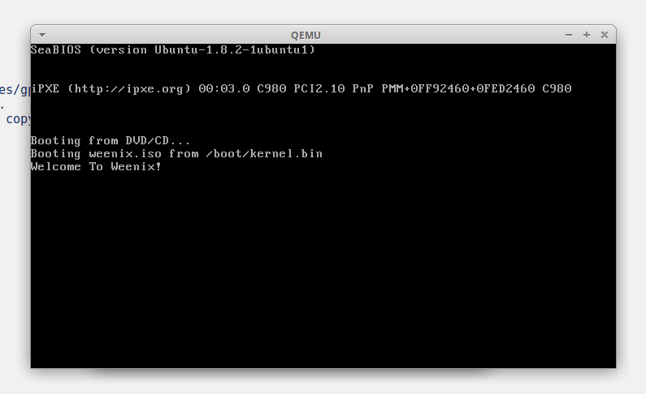
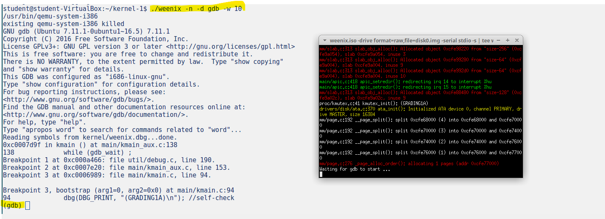

# weenix-kernel
Documentation and results from my work on the weenix OS kernel development. 

## Setup

Quick instructions for getting Weenix to run on
Redhat-derived or Debian-derived Linux flavors.  

1. Download and install dependencies.

   On recent versions of Ubuntu or Debian, you can simply run:
   ```
   sudo apt-get install git-core build-essential gcc gdb qemu genisoimage make python python-argparse cscope xterm bash grub xorriso
   ```
   or on Redhat:
   ```
   $ sudo yum install git-core gcc gdb qemu genisoimage make python python-argparse cscope xterm bash grub2-tools xorriso
   ```
2. Compile Weenix:
   ```
   make
   ```
3. Invoke Weenix:
```
   $ ./weenix -n
```
   or, to run Weenix under gdb, run:
```
   $ ./weenix -n -d gdb
```
To run Weenix under gdb, compilation should be done after setting `GDB_WAIT=1` in Config file

## Implementation

Developed the core of a small Unix-like operating system. Iteratively implemented:

Part 1: Threads, Processes, and synchronization primitives

Part 2: Virtual File System

Part 3: Virtual Memory and system calls.

Detailed documentation covering data structures, concepts, and design diagrams is provided in the `docs/` directory.

Part 1 doc: https://github.com/manasabsv26/weenix-kernel/blob/main/docs/Kernel%20Project%20Design%20Part%201.pdf

## Execution output

1. QEMU terminal


2. Weenix kernel started with gdb



3. kshell, after part 1 of kernel development (with clean halt)


Detailed description of tests run and output logs (faber and sunghan in this image) are present in `outputs/Outputs_part1.pdf`


